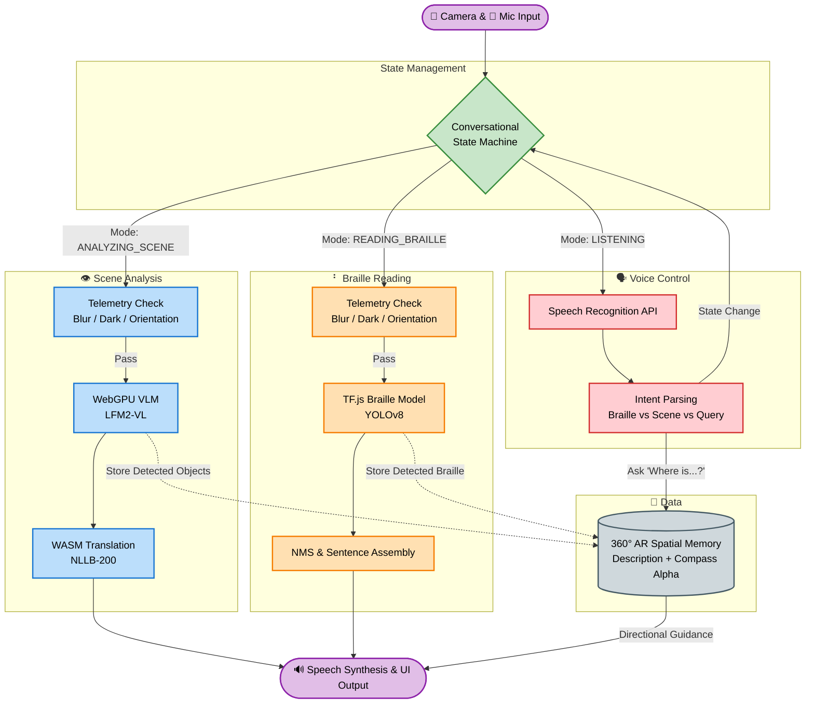

# Braille Vision Assistant: Architecture & Workflow Document

## Overview
The **Braille Vision Assistant** is a cutting-edge, fully client-side edge AI application designed to assist visually impaired individuals. It has evolved into a fully conversational, voice-controlled assistant that runs entirely in the browser. By leveraging WebGPU and WebAssembly (WASM), it performs low-latency scene analysis and real-time Braille translation without relying on backend server processing.

---

## Key Features

- **100% Client-Side Edge AI**: Runs completely locally using WebGPU, TensorFlow.js, and WebAssembly. No cloud servers are required, ensuring maximum privacy and offline capability.
- **Conversational Voice Interface**: Hands-free interactions using natural language. Users can use voice commands to describe scenes, read Braille, or ask questions.
- **Real-Time Scene Analysis**: Continuous visual descriptions using an optimized WebGPU vision-language model (`LFM2-VL-450M`).
- **On-Device Translation**: Translates English descriptions into multiple languages using the `NLLB-200` model.
- **Automated Braille Translation**: Identifies 6-dot Braille characters via a custom YOLOv8 model, grouping bounding boxes into words and sentences automatically.
- **360° AR Spatial Memory (Breadcrumbs)**: Remembers the compass heading of detected objects and Braille. Users can ask "Where is the door?" to receive relative directional guidance (e.g., "Turn left 45 degrees").
- **Priority Hazard Warning**: Detects urgent hazards (e.g., cars, stairs, poles) and interrupts standard speech with immediate, high-priority alerts.
- **Intelligent Telemetry & Guidance**: Checks the camera and gyroscope for blurriness, poor lighting, or bad device orientation, giving the user audio feedback to correct their aim.
- **Spatial Audio Guidance**: Emits stereo-panned audio ticks to help the user physically center the camera on detected Braille text.
- **Glassmorphism Dark UI**: A high-contrast, premium interface designed with accessibility in mind.

---

## High-Level Architecture

The system is built on an **Edge AI architecture**, prioritizing privacy, low latency, and offline-capable inference. It utilizes three concurrent AI pipelines managed by a central state machine:

1. **WebGPU Vision-Language Pipeline**: Powered by Transformers.js, running an optimized ONNX vision-language model (`LFM2-VL-450M`) natively on the device's GPU.
2. **WASM Translation Pipeline**: Utilizes the `nllb-200-distilled-600M` model via WebAssembly to translate the English outputs of the VLM into the user's preferred language.
3. **TensorFlow.js Object Detection Pipeline**: Runs a custom YOLOv8 model to detect and decode 6-dot Braille characters from video frames in real-time.

---

## System Workflow Diagram

---

## Core Components & Workflows

### 1. Conversational State Machine
The core application loop is governed by a synchronous state machine that prevents overlapping AI requests and audio collisions. The primary states include:
- `IDLE`: Awaiting user activation.
- `ANALYZING_SCENE`: Continuously analyzing frames using the VLM to describe the environment.
- `READING_BRAILLE`: A highly specialized, high-frequency frame loop specifically hunting for and translating Braille.
- `LISTENING`: Activating the microphone to capture user intents.
- `ASKING_INTENT`: Prompting the user for conversational direction.

### 2. Telemetry & Pre-Processing Gatekeeper
Before any heavy GPU inference occurs, a lightweight telemetry gatekeeper checks the frame and device status:
- **Blur & Lighting Detection**: Prevents the AI from processing blurry or overly dark frames, prompting the user with TTS to "hold steady" or "find a light source".
- **Gyroscope Guidance**: Uses device orientation sensors to ensure the user is holding the device upright, providing audible corrections if they are not.

### 3. Scene Analysis Workflow
When the user asks to look around:
1. A base64 frame is extracted from the camera.
2. The WebGPU VLM processes the frame against a strict prompt instructing it to describe the scene concisely and check for Braille.
3. The response is streamed, normalized, and checked against a **Hazard Vocabulary** (e.g., cars, stairs).
4. If a hazard is detected, the priority warning system overrides standard TTS.
5. The output is translated (if necessary) and spoken to the user.

### 4. Braille Reading Workflow
When the user requests to read or the VLM spots potential Braille:
1. The state machine shifts to `READING_BRAILLE`.
2. The TF.js YOLOv8 model runs inference on 320x320 normalized frames.
3. **Spatial Audio Cues**: As individual characters are detected, a synthesizer plays high-pitched ticks, panned left or right to guide the user's camera aim.
4. **Sentence Assembly**: Detections are sorted temporally (top-to-bottom Y-axis) and then grouped into lines. Within each line, characters are sorted left-to-right, with intelligent space insertion based on average character width.
5. Once the exact same string is confidently read across 3 consecutive frames, it is translated and spoken.

### 5. 360° AR Spatial Memory (Breadcrumbs)
A standout feature of the architecture is its short-term spatial memory:
- Whenever the VLM describes an object or the TF.js model reads Braille, the exact timestamp and the device's compass heading (`alpha` orientation) are recorded in an array.
- When the user asks a conversational query like *"Where is the door?"*, the intent parser intercepts the query.
- It scans the memory array, finds the closest match, calculates the angular difference between the user's current compass heading and the memory's heading, and provides dynamic instructions (e.g., *"The door is about 45 degrees to your left. Turn left."*).

---

## Conclusion
The Braille Vision Assistant represents a paradigm shift from traditional API-bound accessibility tools. By leveraging modern browser technologies (WebGPU, WASM, TF.js, and native Speech/Sensor APIs), it orchestrates a complex, multi-model conversational loop that is highly responsive, context-aware, and completely private.
