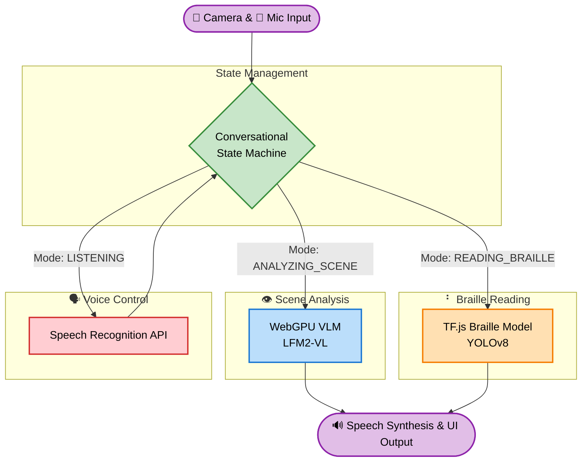

# Braille Vision Assistant

A 100% client-side, real-time React web application designed to assist visually impaired individuals by narrating their environment and teaching Braille. It captures live camera feeds, runs them through the lightweight **LFM2-VL-450M-ONNX** vision-language model, and uses a custom **YOLOv8** object detection model for Braille translation—all entirely in the browser. It speaks context-aware descriptions back to the user via Text-to-Speech (TTS).

## Features

- **100% In-Browser Inference**: Uses `transformers.js` to run the Vision-Language Model (`onnx-community/LFM2-VL-450M-ONNX`) securely via WebGPU, and uses `TensorFlow.js` to run the custom YOLOv8 Braille translation model. No backend server required!
- **Real-Time Scene Descriptions**: Captured frames are analyzed continuously or on-demand via voice commands.
- **Braille Translation & Learning**: Switch to Braille mode to actively detect and translate physical Braille using the YOLOv8 model. The app also features an interactive, haptic-enabled dictionary that teaches the Braille alphabet with native vibration feedback and voice synthesis.
- **Voice Commands**: Integrated Speech Recognition lets users ask questions about their surroundings directly.
- **Premium UI**: A highly visible, accessible, dark-themed interface built with modular React components and CSS Modules.

## Prerequisites

- **Modern Web Browser**: Google Chrome or Edge (v113+) is strongly recommended as they have full support for WebGPU, SpeechRecognition, and Web Speech API (TTS).
- **GPU Acceleration**: A discrete or integrated GPU is recommended. The app will automatically fall back to WebAssembly (WASM) CPU inference if WebGPU is unsupported, but it will be significantly slower.

## Installation & Running

Since the application runs entirely in the browser, no Python backend is required. The `backend` directory is kept empty for future API offloading if needed.

### 1. Install Dependencies
Navigate into the frontend directory and install the Node.js packages:

```bash
cd frontend
npm install
```

### 2. Start the Development Server
```bash
npm run dev
```

### 3. Open the App
Navigate to the local Vite URL (e.g., `http://localhost:5173`) provided in your terminal.

*(Note: To use the rear camera on mobile devices over a local network, you MUST access the site via HTTPS or localhost. Browsers block camera access over plain HTTP on remote IP addresses).*

## Usage

1. Open the application.
2. Allow **Camera**, **Microphone**, and **Motion/Orientation** permissions.
3. Wait for the `LFM2-VL-450M-ONNX` and `YOLOv8` Braille models to download and initialize on your first run (they will be cached by the browser for subsequent visits).
4. Tap **Tap to Start**.
5. Switch between **Live Assistant** (for scene narration) and **Braille Learner** (for braille education).
6. Press the microphone toggle to ask questions, or use the vision/braille toggles to switch analysis modes.

## Project Architecture



- **`frontend/src/App.jsx`**: Global controller and model initialization.
- **`frontend/src/components/`**: Clean UI boundaries for the Header, Camera view, and Braille interfaces.
- **`frontend/src/lib/`**: Contains the core logic for the Vision Language Model (`webgpu_vlm.js`), the YOLOv8 TensorFlow.js Braille translation (`braille.js`), and TTS/Camera abstractions.
- **`frontend/src/hooks/`**: Custom React hooks (`useCamera`, `useSpeechRecognition`) bridging the gap between browser APIs and the React component lifecycle.
